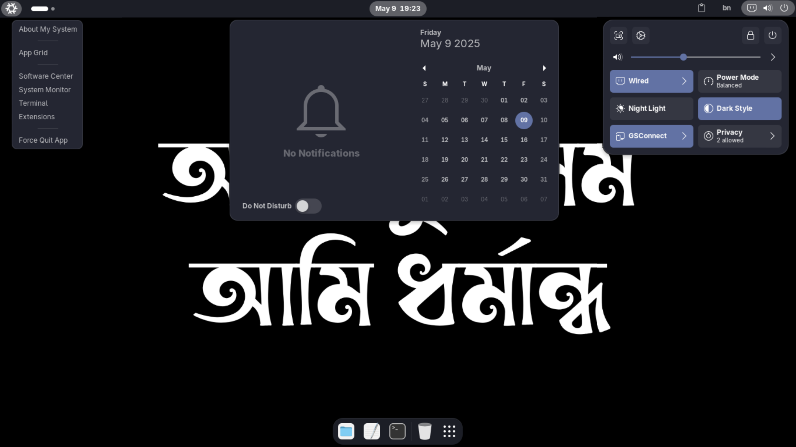
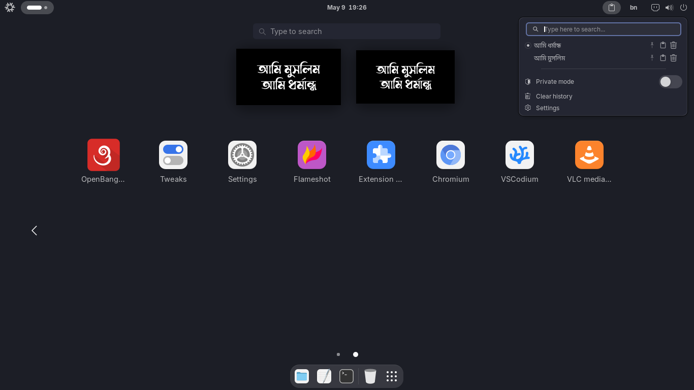

# GNOME Setup

A simple and clean GNOME desktop configuration for my personal use.
I’ve uploaded it here to make it easy to set up again in the future.

## Preview

<p align="center">
  
  
</p>


## How to Use

If you like this setup, feel free to use it.

### Method 1: Without Using the Terminal

1. Download and extract this repository.
2. Inside the folder, locate the file named `restore.sh`.
3. Right-click on `restore.sh`, go to **Properties**, and toggle on **Executable as program**.
4. Then, right-click the file and select **Run as Program**.

### Method 2: Using the Terminal

```bash
git clone https://github.com/qomarhsn/gnome-setup
cd gnome-setup
chmod +x restore.sh
./restore.sh
```